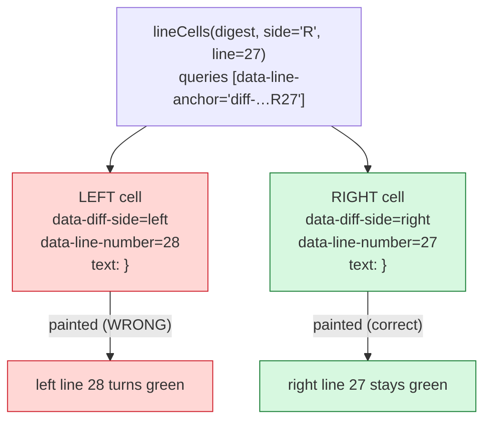

# The "left line 28 lights up out of nowhere" bug

> [!summary] TL;DR
> The extension highlights GitHub diff lines by their **anchor** (`data-line-anchor`).
> In GitHub's new **split** diff view, the two cells of an aligned row (old line on
> the left, new line on the right) are given the **same** anchor — the *right* line's.
> So when the extension painted a right-side highlight, the matching query also
> returned the **left-column cell on that row**, and painted it too. The fix is to
> stop trusting the ambiguous anchor and match on each cell's own
> `data-diff-side` + `data-line-number` instead.

---

## 1. Context: how the extension highlights a diff

The extension overlays [RefactoringMiner](https://github.com/tsantalis/RefactoringMiner)'s
detected refactorings onto GitHub PR diffs. RefactoringMiner publishes a JSON feed
where every refactoring has **left-side** and **right-side** locations:

```json
{
  "type": "Extract Method",
  "rightSideLocations": [
    { "filePath": "kotlin/OrderProcessor.kt", "startLine": 22, "endLine": 27,
      "codeElementType": "METHOD_DECLARATION", "description": "extracted method declaration" }
  ]
}
```

To colour those lines, the extension has to find the corresponding **diff cells** in
the page's DOM. GitHub identifies each diff line with a deterministic id:

```
diff-<sha256(filePath)><L|R><lineNumber>
```

- **Classic `/files` view:** the code cell has this as its element **`id`**.
- **New `/changes` (React) view:** the cell carries it as **`data-line-anchor`**.

So the core lookup is:

```js
// src/github.js — BEFORE
function lineCells(digest, side, line) {
  const anchor = `diff-${digest}${side}${line}`;            // e.g. diff-7382fe…R27
  const byData = document.querySelectorAll(`[data-line-anchor="${anchor}"]`);
  if (byData.length) return [...byData];
  const byId = document.getElementById(anchor);             // classic view fallback
  return byId ? [byId] : [];
}
```

`digest` is `sha256(filePath)`. For `kotlin/OrderProcessor.kt` it is
`7382feb2…fdfcbcb2`.

> [!info] Why an anchor and not DOM scraping?
> The id is a pure function of the file path and line, so the extension never has to
> walk the DOM to figure out which file a row belongs to. This is fast and robust —
> **as long as the anchor is unique per cell.** That assumption is exactly what breaks.

---

## 2. Symptom

On a Kotlin PR (`OrderProcessor.kt`), the **left** column showed line 28 — a bare
closing brace `}` — highlighted **green**, even though:

- nothing in the RefactoringMiner JSON referenced left line 28, and
- green is the **"Inserted"** colour, which only ever belongs to the **right** (new) side.

A left-side cell showing an *inserted* colour is a contradiction — that was the tell
that something was being painted in the wrong place.

```
LEFT (old)                         RIGHT (new)
26  private fun centsToDollars…    26  return discountedSubtotal + tax
27  return cents / 100.0           ⟵ (blank, alignment padding)
28  }   ←★ green, "inserted"       27  }   ← genuinely inserted, green ✓
```

★ = the bug: left `}` lit up with the right side's colour.

---

## 3. Investigation (what it was *not*)

Three plausible causes were ruled out before the real one was found — worth recording
because each is a real class of bug in browser-extension/DOM work.

> [!example]- Ruled out #1 — Stale extension code
> The browser was running an **older build** of the extension (injected before a code
> change), which over-highlighted whole method bodies. Reloading the *page* re-injects
> the cached build; only reloading the *extension* picks up new source.
> **Fix that stuck:** a load-time console stamp — `[RMX] content script loaded — build 0.3.0` —
> so "is the latest code running?" is a one-second check.

> [!example]- Ruled out #2 — Virtualized DOM node recycling
> The `/changes` diff is a **virtualized list**: it reuses DOM nodes as you scroll.
> A node painted for one line can be recycled to render another, carrying the highlight
> with it. This is a genuine latent bug (fixed separately with a reconcile pass), but
> it was **not** the cause here — it produces scattered stale highlights, not a clean
> wrong-column paint.

> [!example]- Ruled out #3 — Wrong digest
> A red herring: the page URL ended in `…8e8bfd98…L20`, which did **not** equal
> `sha256("kotlin/OrderProcessor.kt")`. It turned out `8e8bfd98…` is
> `sha256("kotlin/CustomerProfile.kt")` — a *different* file the URL anchor pointed to.
> The digest scheme was correct all along.

The decisive step was to **read the actual DOM** instead of reasoning about it — dump
every highlighted cell and its attributes.

---

## 4. Root cause: one anchor, two cells

Dumping the two `}` cells that shared the anchor `…R27` revealed this:

| attribute | LEFT cell | RIGHT cell |
|---|---|---|
| `data-line-anchor` | `diff-7382fe…**R27**` | `diff-7382fe…**R27**` |
| `data-diff-side` | `left` | `right` |
| `data-line-number` | `28` | `27` |
| `data-diff-line-key` | `b:27-l:28-r:27` | `b:27-l:28-r:27` |
| rendered text | `}` | `}` |

The two cells of the **aligned row** share one `data-line-anchor` — and GitHub chose
the **right** line's value (`R27`) for both. So the left-column cell for old line 28
is labelled `…R27`, **not** `…L28`.

> [!bug] The collision
> `querySelectorAll('[data-line-anchor="diff-7382fe…R27"]')` returns **two** elements:
> the real right-27 cell **and** the left-28 cell. The extension painted both. The
> left `}` inherited the right side's "Inserted" green.

This also explains an earlier dead end: querying for `…L28` returned **nothing**,
because GitHub never assigns that anchor — the left-28 cell lives under `…R27`.

### Why GitHub does this

A split diff keeps the two columns aligned **row for row**. The diff algorithm paired
old `}` (line 28) with new `}` (line 27) on one row, and keyed the whole row by a single
anchor. The `data-diff-line-key="b:27-l:28-r:27"` literally encodes it: **b**ase 27,
**l**eft 28, **r**ight 27. The per-column truth lives in `data-diff-side` and
`data-line-number`, not in the shared anchor.



---

## 5. The fix

Stop trusting the shared anchor. Match on the attributes that are **unique and correct
per cell** — `data-diff-side` (`left`/`right`) and `data-line-number` — and scope to the
right file with the digest prefix. The classic `/files` view (unique element `id`)
remains the fallback.

```js
// src/github.js — AFTER
function lineCells(digest, side, line) {
  const sideAttr = side === 'L' ? 'left' : 'right';
  const candidates = document.querySelectorAll(
    `[data-diff-side="${sideAttr}"][data-line-number="${line}"]`,
  );
  const inFile = [...candidates].filter((el) => {
    const key = el.getAttribute('data-line-anchor') || el.getAttribute('data-grid-cell-id') || '';
    return key.indexOf('diff-' + digest) === 0;   // scope to this file
  });
  if (inFile.length) return inFile;

  const byId = document.getElementById(`diff-${digest}${side}${line}`); // classic view
  return byId ? [byId] : [];
}
```

> [!success] Result
> - Painting **R27** now matches only the cell with `data-diff-side="right"` and
>   `data-line-number="27"` → the left `}` is never touched.
> - It also fixes the *opposite* failure: a left cell that GitHub mislabels with the
>   right anchor is now reachable as `L28`, because we match by side + line number,
>   not by the anchor.

Verified directly: the old anchor-only lookup returned **2** cells (sides `left,right`);
the new lookup returns exactly **1** correct cell.

---

## 6. Why the automated tests didn't catch it

The project has an end-to-end harness that runs the **real** painting code over a
reconstructed diff DOM, per language. It didn't catch this because it builds the DOM in
the **classic** style, where each anchor maps to exactly **one** element with a unique
`id` — so the collision *cannot occur there*. The bug is specific to the React split
view's shared-anchor structure.

The lesson: the offline harness faithfully validates painting **decisions** (which lines,
which colour, which side), but **view-specific DOM quirks** need targeted tests that model
the real React structure.

A focused regression test now reproduces the collision:

```js
// test/highlight/split-collision.test.js (essence)
// One aligned row: left line 28 `}` and right line 27 `}`, BOTH anchored R27.
const r27 = RMX.github.lineCells(digest, 'R', 27);
const l28 = RMX.github.lineCells(digest, 'L', 28);

assert(r27.length === 1 && r27[0].getAttribute('data-diff-side') === 'right');
assert(l28.length === 1 && l28[0].getAttribute('data-diff-side') === 'left');
assert(r27[0] !== l28[0]);   // a right-side paint can never touch the left cell
```

It was confirmed to **fail on the old code** (lookup returned both cells) and **pass on
the fix**.

---

## 7. Takeaways

> [!quote] One-line lesson
> An identifier is only safe to key on if it is **unique for the thing you think it
> identifies.** GitHub's `data-line-anchor` identifies a *row*, not a *cell* — and the
> code assumed a cell.

- **Read the DOM, don't reason about it.** Three hypotheses were eliminated only once the
  real attributes of the offending element were dumped.
- **A contradiction is a strong lead.** "An *inserted* (right-side) colour on the *left*
  side" pointed straight at cross-column bleed.
- **Match on intrinsic, per-element truth.** `data-diff-side` + `data-line-number` describe
  the cell itself; the shared anchor describes its row.
- **Model the quirky structure in a test.** The general harness can't represent every
  view; the bug-specific structure earns its own small test.

---

### Appendix — the "empty line" question

The blank row between right lines 26 and 27 is **not** a bug and **not** the extension —
it is GitHub's split-diff **alignment padding**. The old `centsToDollars` had a line
(`return cents / 100.0`, left 27) that was deleted and has no counterpart on the new side,
so GitHub inserts a blank spacer in the right column to keep the two sides aligned row for
row. It has no `data-line-number`, so the extension never paints it.
